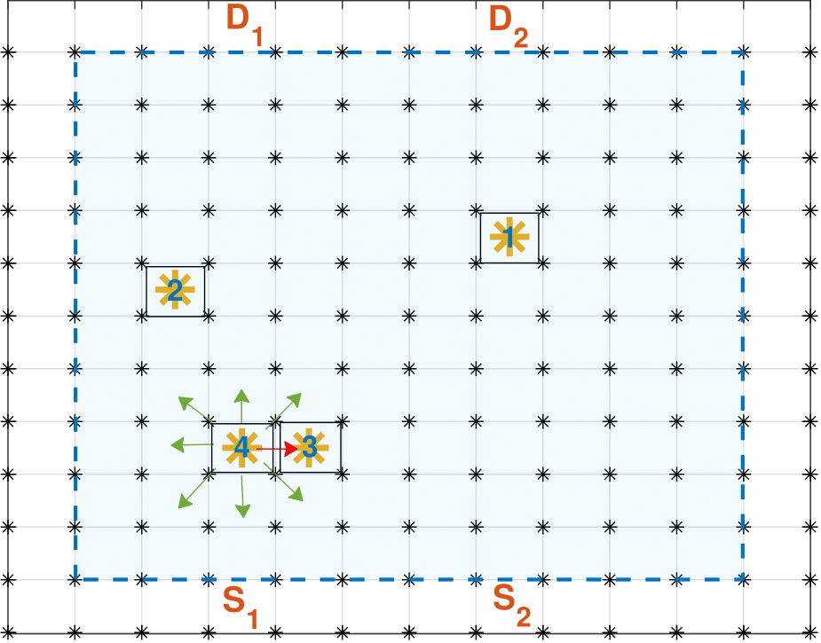
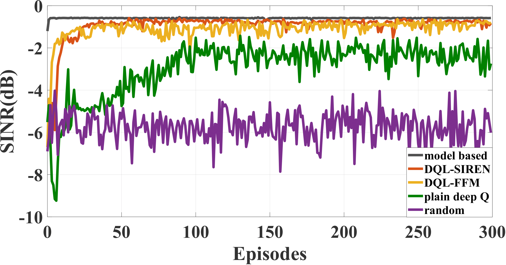

### **Deep Q Learning with Sinusoidal Representation Networks (SIRENs) for Motion Control in Wireless Autonomous Networks**


This is a Variation of the Deep Q Learning algorithm for Discrete Motion Control in Mobile Beamforming Wireless Autonomous Networks in PyTorch.
It is part of a paper on the topic, submitted at the Transactions of Signal Processing Journal (TSP) on the Domain of Deep Learning for Wireless Communications

---

# Prerequisites
- python: version==3.9.4
- pytorch: version==1.7.1
    - install the siren package for pytorch : pip install siren-pytorch
- numpy: version==1.20.2


**Table of Contents**
1. [General Problem Formulation] (#General Problem Formulation)
1. [Set up] (#Set up)
1. [Channel Model] (#Channel Model)
1. [Optimization] (#Optimization)
1. [Reinforcement Learning] (#Reinforcement Learning)
1. Deep Q Learning for Motion Control for single-source destination communication pair in Wireless Autonomous Networks
1. The Spectral Bias and how it relates to the problem at hand
1. SIRENs (Sinusoidal Representation Networks)
1. Results
1. Data
1. Specifications for the Deep Q Learning and the Deep Q Learning with SIRENs


# General Problem Formulation
We consider joint beamforming and relay motion control in mobile relay beamforming networks, operating in a spatio-temporally varying channel environment.  A time slotted approach is adopted, where in each slot, the relays - drones implement optimal beamforming and estimate their optimal positions to locate themselves for the next slot. 
 We place the problem of relay motion control in a sequential decision-making framework.
We employ Deep Reinforcement Learning (RL) to guide the relay motion, with the goal of maximizing the cumulative Signal-to-Interference+Noise Ratio (SINR) at the destination.

# Set up 
We consider a **2-dimensional grid** and a communications source and destination pair. The source and the destination cannot communicate directly (No Line-of-Sight), therefore we employ some **relays-drones** as individual intelligent agents to assist the communication of the pair. The agents can move to exploit the spatiotemporal correlations of the channel in order to achieve high SINR at the destination. 
The grid is dissected into grid cells. Each drone can occupy, at most one grid cell, during every time slot. The decision for the displacement for each drone at every time slot pertains to the choice of which neighboring cell to move to (or stay in the same grid cell). That constitutes **a set of 9 possible actions**: 
* moving North ('N')
* moving South ('S')
* moving West ('W')
* moving East ('E')
* moving NorthWest ('NW')
* moving NorthEast ('NE')
* moving SouthWest ('SW')
* moving SouthEast ('SE')
* staying ('Stay')



In our case we investigate the case where there is only 1 source and 1 destination (3 drones-agents to facilitate the communication). 

# Channel Model

The statistical description of the channel between the source and the r-th relay, located at position  during time slot , can be modeled as a product of four terms 
where  is the path-loss component, with  being the path-loss exponent;  the shadow fading component;  the multi-path fading component; and  is the phase term, with  uniformly distributed in [0,1]. A similar decomposition holds for the relay-destination channel .

On taking the logarithm of the squared channel magnitude  we obtain the additive model 

So we have, 
 ,
,


In the above,  is the shadowing power, and  ,  are respectively the mean and variance of the multipath fading component.

Although the multipath fading component, , is i.i.d. between different positions and times, the shadowing component,  is correlated.
Specifically, the shadowing component  (similarly ), between any two positions  and , at two  time slots  and , exhibits correlations according to


where, 


with   denoting the correlation distance, and  the correlation time. Additionally, we consider 


where,


and  denoting the correlation distance of the source-destination channel.

# Optimization

In order to jointly schedule the relay communication and movement on a per time slot basis, we adapt a 2-stage problem formulation . In the following, we design the beamforming weights and develop the relay motion control strategies.
At every time slot the relays must determine the optimal beamforming weights  that maximize the SINR at the destination, subject to a transmission power constraint on the relays.This can be formulated as: 

 

where  is the transmission power budget of all relays.
The optimal value has a closed form expression 


This is a distributed expression, where each one of the terms in the summation is a function only of the channel magnitudes that pertain to each individual relay. Therefore, maximizing the destination's SINR at a time slot , is equivalent to every relay maximizing its own local  

# Reinforcement Learning 

In Reinforcement Learning, we consider an intelligent agent that interacts with the Environment with the goal of learning to behave in a sequential fashion so as to maximize the expectation of cimulative reward.
At a given time step  the agent is at a state  and wants to choose actions . When in state  and committing action  the agent receives a reward  and transitions to a new state . The goal is for the agent to learn a bevavior (policy) to maximize the expected discounted sum of rewards.

# Deep Q Learning 
When the set of possible actions, that the agent can choose from at every state, is discrete (discrete control), the agent can learn a state-action value function  that quantifies the sum of discounted rewards that the agent is expected to aggregate when in state  performs action . In tabular settings, the  function can be learned by temporal differences (applying the Bellman operator).
Tabular Q Learning does not scale for large state-action spaces and a more recent developments uses neural networks for approximating the  function (Deep Q Learning).

# Deep Q Learning for Motion Control for single-source destination communication pair in Wireless Autonomous Networks 
The state is comprised by a vector of the coordinates of the grid cell, where the relay is located. The reward  is the respective .
At each time slot the relay selects an action  (from the set of actions described in [Set up section](# Set up) )
The training of neural networks for  function approximation, generally, requires two known mechanisms that assist with stability and convergence.
The first mechanism is the *Experience Replay*. 
Each tuple of experience for a relay, namely , is stored in a memory buffer called Experience Replay. At each step of the neural network weight update, we sample uniformly a batch of experiences from the Experience Replay and use that batch to perform minibatch gradient descent using the loss function: 


This process is part of the pipeline to ensure that the inputs to the neural network, during training, are not as correlated as they would be if we were to perform updates on consecutive experiences from a given relay motion trajectory. Therefore, at each update step the neural network weights are updated according to:


where,


The parameter  is a small scalar step size, denoted as the ~~learning rate~~.
he parameter  is denoted as the *discount factor*
and quantifies the amount of importance that the algorithm assigns to delayed rewards.

The second stability mechanism used is the *Target Network*. The Target Network () is a neural network that provides the  estimate at every update step. This network has the same architecture as the main network (we will denote this as the *Policy Network* - not to be confused with a network parametrizing the policy in Policy Gradient or Actor Critic methods), .

The Target Network's weights are kept frozen throughout the update process as we do not perform gradient descent on these weights, but occasionally we copy the weights of the Policy Network to the Target Network. This provides stationary targets for the weight updates and brings the task of the  function approximation closer to a supervised set up.

The displacement of the relays at each time slot (choosing any action other than ) results in additional energy consumption. To promote energy preservation, we do not perform the -greedy policy directly on the estimates  of the  function (output of the Policy Network at every time slot), but rather we subtract a small percentage, , from the estimates for all actions , except for the action . In that fashion, we discourage relay displacement if the value of the  function, for the action that requires moving, is not much higher than the value of  for staying. This is a mechanism that promotes energy preservation. The choice of  quantifies a trade off between energy preservation and cumulative SINR at the destination.


# The Spectral Bias and how it relates to the problem at hand

In the vanilla case of our algorithm we use Multilayer Perceptrons (MLPs) for the Target and the Policy neural networks.
Recent works have demonstrated that MLPs that take as input coordinates and are trained with a Mean Squared Error Loss, to approximate a low-dimensional signal, fail to learn high frequency components of the signal at hand. This phenomenon is called *Spectral Bias* of MLPs. To analyze the spectral bias, one should model (in the limit) the behavior of an MLP during training for regression tasks as a kernel regression with the **Neural Tangent Kernel** (NTK). The resulting NTK is a kernel with rapid spectral fall off.

In our case, the Policy Network is an MLP that is trained to map coordinates (the coordinates of the respective grid cell position of any of the relays) to a low dimensional signal, namely the state-action value function $Q$. The MLP may not be able (and it actually is not as it stems from our simulations) to track the high variability of the  function that derives from the high variability of the channel magnitude with respect to time and space. 

A recent paper "Implicit Neural Representations with Periodic activations", Sitzmann et al that has been published in NeurIPS 2020 (Spotlight) introduces a new neural network architecture, called Sinusoidal Representation Networks (SIRENs) and convincingly claim to overcome the spectral bias 

# SIRENs (Sinusoidal Representation Networks)

The performance of SIRENs  heavily depends on the initialization of the weights of each network layer needed to preserve the distribution of activations through the network, during training.
Assuming an intermediate layer with input , then taking a linear combination of the input weighted with , the output is . Since the layer is intermediate, the input  is arcsine distributed. With these assumptions it was shown that if the elements of , namely , are initialized from a uniform distribution  as  grows. Therefore one should initialize the weights of all intermediate layers with . The neurons of the first layer are initialized with the use of a scalar hyperparameter , so that the output of the first layer,  spans multiple periods over [-1,1].  is a matrix whose elements correspond to the weights of the first network layer.
Again, we adapt this concept for the problem of Deep Q learning for relay motion control, because the Policy Network is a function approximator for a low-dimensional target signal (essentially, maps coordinates to the  values). The MLP might not be able to track the high variability of the  function that derives from the high variability of the channel magnitude with respect to time and space. We employ SIRENs for the Target and the Policy Network respectively.


# Results

We demostrate the results of the Vanilla Deep Q Learning and of the Variation with SIRENs (we call DQL-SIREN) and compare them with a model based approach for the same problem and a variation with the use of Fourier Features, that also targets the spectral bias (we call DQL-FFM)



It is prevalent that the use of SIRENs (and the use of Fourier Features) significantly impacts the speed of convergence and the rewards of the resulting policies. 

# Data

we plot the system performance of all motion control methods. We plot the average SINR at the destination (in dB scale) achieved by the cooperation of all $3$ relays, per episode, for 300 episodes, where every episode is comprised by $400$ steps. The transmission power of the source is  and the relay transmission power budget is . The assumed channel parameters are set as ,, , , , , . The variance of the noise at the relays and destination are .

The data used for the simulations are contained in the two files ("f_maps.npy" and "g_maps.npy").
If one wants to create their own data they can use the function Perfect_CSI.npy contained in the Environment.py file. It is also given below:

``` python
def Perfect_CSI(pathlossF_S, pathlossF_D, C_SD, C_SD_chol, kappa):
    
    """ 
    This function creates a dataset for the channel magnitudes to the source and destination for all grid cells of a given grid and for all time slots in 
    a time horizon. 
    """

    
    f_Sphase = np.exp(1j*2*np.pi*np.random.uniform(0,1,(rMap_RowCells, rMap_ColCells, numSlots+1)))
    f_Dphase = np.exp(1j*2*np.pi*np.random.uniform(0,1,(rMap_RowCells, rMap_ColCells, numSlots+1)))

    f_Smaps = np.zeros([rMap_RowCells, rMap_ColCells,numSlots+1], dtype=complex)
    f_Dmaps = np.zeros([rMap_RowCells, rMap_ColCells,numSlots+1], dtype=complex)


    # Generate the spatiotemporal process     
    beta_t = (np.random.randn(C_SD[0,:].shape[0]) @ scipy.linalg.cholesky(C_SD) ).T # initial shadowing term at time t=0 (X_0 initial)

    for i in range(numSlots+1):
        #(Innovation) Generate the driving noise of the AR process
        W_t = (np.random.randn(C_SD[0,:].shape[0]) @ C_SD_chol ).T
        beta_t = kappa * beta_t + W_t #Update the shadowing term for time t
        # Add multipath fading...
        temp = np.array(beta_t + np.sqrt(sigma_xiSQ)*np.random.randn(C_SD[0,:].shape[0]).T)
        temp_S = temp[0:int(temp.shape[0]/2)] # "shadowing + multipath" term (in dB) of source to "points in grid" channels
        temp_D = temp[int(temp.shape[0]/2):] #shadowing + multipath term (in dB) of "points in grid" to destination channels
        
        #add the respective path-loss
        Temp_F_Smaps = pathlossF_S + np.reshape(temp_S, (rMap_RowCells, rMap_ColCells) )#"F_S" channels (in dB) from source to "grid cell" 
        Temp_F_Dmaps = pathlossF_D + np.reshape(temp_D, (rMap_RowCells, rMap_ColCells) )#"F_D" channels (in dB) from "grid cell" to destination 

        # Grid channels in linear scale
        f_Smaps[:,:,i] = (10**(Temp_F_Smaps/20)) * f_Sphase[:,:,i]
        f_Dmaps[:,:,i] = (10**(Temp_F_Dmaps/20)) * f_Dphase[:,:,i]

    return f_Smaps, f_Dmaps

```


# Specifications for the Deep Q Learning and the Deep Q Learning with SIRENs

***Deep Q Learning***

* MLPs with 3 layers: 
    * 512 neurons per layer 
* learning rate = 1e-3 
* Adam optimizer 
* Experience Replay Buffer Size = 3000 tuples
* \epsilon goes from 1 to 0.01
* batch size = 64

***Deep Q Learning with SIRENs***

* MLPs with 3 layers: 
    * 350 neurons per layer 
* learning rate = 1e-4 
* Adam optimizer 
* Experience Replay Buffer Size = 3000 tuples
* \epsilon goes from 1 to 0.01
* batch size = 64

